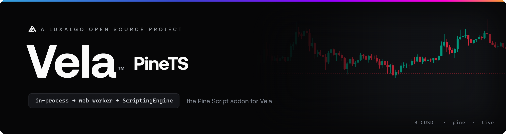

<!-- markdownlint-disable no-inline-html first-line-h1 -->

<div align="center">

  

  <p><strong>Pine Script indicators and strategies for Vela.</strong><br>
  In-process · Web Worker · Vela's public ScriptingEngine port</p>

  [![npm version][npm-version-img]][npm-link]
  [![Downloads][npm-downloads-img]][npm-link]
  [![License][license-img]][license-link]

  <p>
    <a href="https://github.com/LuxAlgo/Vela">Vela</a> ·
    <a href="#quick-start">Quick start</a> ·
    <a href="CHANGELOG.md">Changelog</a> ·
    <a href="#license">License</a>
  </p>

</div>

<!-- markdownlint-enable no-inline-html -->

Vela PineTS is the Pine Script addon for [Vela](https://github.com/LuxAlgo/Vela). It
runs `indicator()` and `strategy()` scripts through Vela's public `ScriptingEngine`
port — in-process (`PineEngine`) or off the main thread (`PineWorkerEngine`). A
`strategy()` script also emits its broker-emulator order fills as
`IndicatorModel.trades`, which Vela paints as on-chart trade markers.

Vela itself ships no scripting engine and stays Apache-2.0. This package is
**AGPL-3.0** because the [PineTS](https://github.com/LuxAlgo/PineTS) runtime it
executes is.

## What's in the box

- **`PineEngine`**: the in-process engine. The simplest setup — transpile and execute
  on the chart's thread.
- **`PineWorkerEngine`**: the same Pine semantics in a Web Worker. The worker source
  is inlined at build time and spawned from a Blob URL, so heavy scripts never block
  the chart.
- **Declaration props**: both engines publish the mutable `indicator()` /
  `strategy()` arguments (`initial_capital`, `precision`, …) as a props schema. Vela
  shows them on the settings dialog's **Properties** tab; hosts override them via
  `addIndicator({ props })` / `handle.setProps()`.
- **Browser builds**: `vela-pinets.global.js` / `.global.min.js` expose
  `window.VelaPinets` for script-tag usage. Load `vela.global.js` first.

## Installing

```bash
npm install @luxalgo/vela-pinets @luxalgo/vela pinets
```

`@luxalgo/vela` and `pinets` are peers of the whole package: the published entry
imports both unconditionally, so each must resolve whichever engine you pick. Vela
is a peer rather than a dependency for the same reason the browser build maps it
onto `window.Vela` — a second copy would duplicate the SDK registries, not just the
bytes. The worker avoids a second *pinets* by inlining its own at build time.

## Quick start

Register the engine, then add a script. The language is `pine`, so calls that omit
`language` still resolve:

```ts
import { Vela } from '@luxalgo/vela';
import { PineEngine } from '@luxalgo/vela-pinets';

const chart = new Vela('#chart', { symbol: 'BTCUSDT', timeframe: '60', live: true });
chart.registerEngine('pine', new PineEngine());
chart.addIndicator(`//@version=5
indicator("EMA 20", overlay=true)
plot(ta.ema(close, 20), color=color.orange, linewidth=2)`);
```

Prefer the chart to stay responsive under heavy scripts? Same port, off the main
thread:

```ts
import { PineWorkerEngine } from '@luxalgo/vela-pinets';

chart.registerEngine('pine', new PineWorkerEngine());
```

The workspace takes an engine factory and an **indicator manifest** — inline JSON,
a URL returning it, or an async loader:

```ts
import { VelaWorkspace } from '@luxalgo/vela/workspace';
import { PineWorkerEngine } from '@luxalgo/vela-pinets';

new VelaWorkspace('#chart', {
    symbol: 'BTCUSDT',
    timeframe: '60',
    live: true,
    engines: { pine: () => new PineWorkerEngine() },
    indicators: '/indicators.json', // or an inline [{ name, script | url, language?, enabled? }]
});
```

Host tooling can execute-and-inject safely with `chart.runIndicator(source)`
(structured errors, no dead legend rows) and read a running script's state,
including its **return value**, via `handle.context()` (read-only snapshots,
worker-safe). See Vela's [scripting engines](https://github.com/LuxAlgo/Vela/blob/dev/docs/user/scripting-engines.md)
guide.

### Browser bundle

The package also ships self-contained browser builds for script-tag usage:
`dist/vela-pinets.global.js` (readable, development) and
`dist/vela-pinets.global.min.js` (minified, production). Either file attaches the
engines to `window.VelaPinets`. Load Vela's `vela.global.js` first so
`@luxalgo/vela` resolves to the page's `window.Vela`.

## Strategies

A `strategy()` script runs through the same engine as an indicator. PineTS's
broker emulator already computes the full ledger; this package emits **one marker
per order fill** as `IndicatorModel.trades`, at the fill bar and price. Ledger
slices of the same fill merge: a reversal paints a single entry carrying the
summed quantity, and an exit that closes several lots FIFO paints once. Order ids
label the markers; a `comment=` replaces the id. Vela paints them on the price
pane.

## Declaration props

Both engines expose the mutable `indicator()` / `strategy()` declaration arguments
through Vela's props channel. `prepare` publishes a schema whose defaults are the
effective values (source-declared ← engine default ← Pine spec), and prop
overrides — add-time, live, or edited on the **Properties** tab — replay the
script.

```ts
const engine = new PineEngine({
    defaultProps: { initial_capital: 50_000 },
    props: 'strategy', // 'all' | 'strategy' | 'none' | a whitelist of prop keys
});

chart.addIndicator({
    script: `//@version=5
strategy("Demo", overlay=true, initial_capital=10000)
if ta.crossover(close, ta.sma(close, 20))
    strategy.entry("Long", strategy.long)`,
    props: { commission_value: 0.05 },
});
```

`defaultProps` sets host-level defaults for scripts that don't declare the prop
themselves. `props` gates which scripts publish the schema — `'strategy'` gives
strategies a Properties tab while plain indicators keep an inputs-only dialog.

## Development

```bash
npm install
npm run playground   # vite playground on http://localhost:5192
npm test             # vitest
npm run build        # tsup → dist/
```

The playground is the Vela widget plus this package's `PineWorkerEngine` (HMR,
engine sources from `src/`). An EMA is on from the first paint; the **Code**
topbar entry runs arbitrary Pine through `chart.runIndicator`.

Vela is consumed as `file:../Vela` (built dist): clone this repo next to
[Vela](https://github.com/LuxAlgo/Vela) and build Vela first.

## License

Vela PineTS is licensed under the **GNU Affero General Public License v3.0**
(see [LICENSE](LICENSE)) because it depends on `pinets`, which is AGPL-3.0.
The Vela charting library itself is Apache-2.0 and carries no Pine code.

[npm-version-img]: https://img.shields.io/npm/v/%40luxalgo%2Fvela-pinets.svg
[npm-downloads-img]: https://img.shields.io/npm/dm/%40luxalgo%2Fvela-pinets.svg
[npm-link]: https://www.npmjs.com/package/@luxalgo/vela-pinets

[license-img]: https://img.shields.io/badge/license-AGPL--3.0-blue.svg
[license-link]: LICENSE
